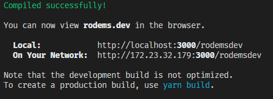

# [rodems.dev](https://www.rodems.dev)
My personal website! I'll be using [rodems.dev](https://www.rodems.dev) as a portfolio, sandbox, and learning tool. Perhaps even a developer blog later on. 

   

## Tools

### SiteTools
- [Create React App](https://github.com/facebook/create-react-app)
- [Github Pages](https://pages.github.com/)
- [Google Domains](https://domains.google.com/) for rodems.dev

### DevTools
- [VSCode](https://www.google.com/url?sa=t&rct=j&q=&esrc=s&source=web&cd=&cad=rja&uact=8&ved=2ahUKEwjJ6ZyzjIPtAhUdGVkFHUiMAUUQFjAAegQIARAD&url=https%3A%2F%2Fcode.visualstudio.com%2F&usg=AOvVaw15O90sm1ios8AUpw56hCml) with some choice extensions that I may list later.
- [Yarn](https://yarnpkg.com/) package manager
- [WSL2](https://docs.microsoft.com/en-us/windows/wsl/install-win10) with [Ubuntu](https://releases.ubuntu.com/20.04/), [OhMyZsh](https://ohmyz.sh/), [Powerlevel10k](https://github.com/romkatv/powerlevel10k), [NerdFonts (Fira Code)](https://www.nerdfonts.com/font-downloads), and [Windows Terminal](https://www.microsoft.com/en-us/p/windows-terminal/9n0dx20hk701?activetab=pivot:overviewtab)

## Installation
- git clone `git@github.com:CoreyRo/rodemsdev.git`
- or download as a [zip file](https://github.com/CoreyRo/rodemsdev/archive/master.zip) then extract the files
- cd into the `src` directory and run `yarn` to install the dependencies
```zsh
cd ~/rodemsdev/source/ui
yarn
```
- run the dev script to start the development server
```zsh
yarn start
```


## Contact info

[corey@rodems.dev](mailto:corey+ghreadme@rodems.dev?subject=I%20saw%20your%20rodems.dev.next%20repo)

<div style='display:flex;flex-flow:row nowrap;align-items:center;'><a href='https://discord.com/' aria-label='A link to discord.com'></a><span style='margin-left: 5px;'>Khrow#3699</span></div>
